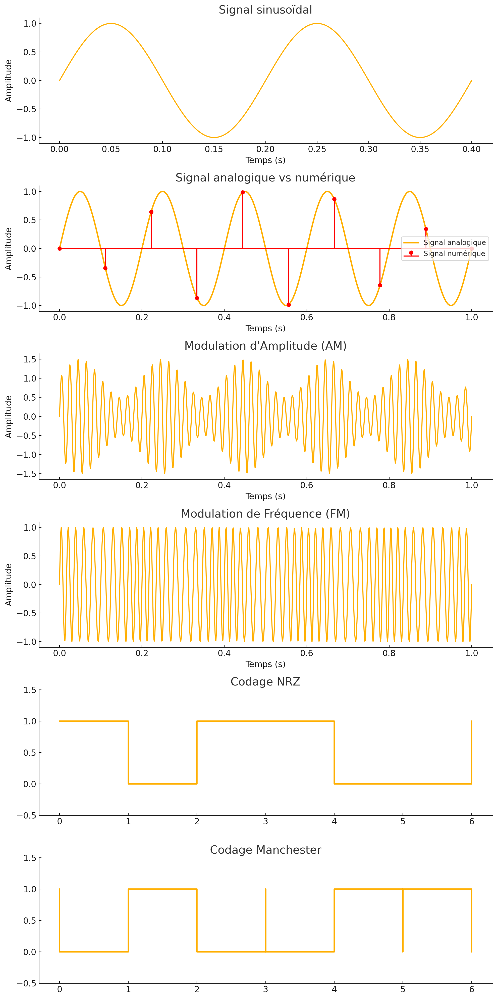

<link rel="stylesheet" href="https://cdn.jsdelivr.net/npm/katex/dist/katex.min.css">
<script defer src="https://cdn.jsdelivr.net/npm/katex/dist/katex.min.js"></script>
<script defer src="https://cdn.jsdelivr.net/npm/katex/dist/contrib/auto-render.min.js"
    onload="renderMathInElement(document.body);"></script>

## Définitions

Avant d’aborder les concepts de modulation et de codage, il est essentiel de définir quelques notions clés :

### Généralités sur les signaux

- **Signal** : Une grandeur physique variant en fonction du temps et utilisée pour transmettre de l'information. Les signaux peuvent être électriques, acoustiques, optiques ou électromagnétiques.
- **Signal analogique** : Signal continu dans le temps et dans l’amplitude, souvent représenté par une fonction sinusoïdale.
  - **Exemple** : Une onde sonore de 1 kHz et 2 V d’amplitude.
- **Signal numérique** : Signal discret, prenant un nombre fini de valeurs (généralement binaires : 0 ou 1).
  - **Exemple** : Un signal binaire avec des niveaux 0V et 5V utilisé dans les circuits logiques.

### Caractéristiques fondamentales d'un signal

- **Fréquence ($$ f $$)** : Nombre d’oscillations d’un signal périodique par seconde, exprimée en Hertz (Hz).
  - **Exemple** : La fréquence du courant électrique est de 50 Hz en Europe et 60 Hz aux États-Unis.
- **Période ($$ T $$)** : Durée d’un cycle complet d’un signal périodique. Elle est reliée à la fréquence par la relation :  
  $$ T = \frac{1}{f} $$
- **Amplitude ($$ A $$)** : Valeur maximale du signal, représentant son intensité.
  - **Exemple** : Une onde radio avec une amplitude de 10 mV.
- **Phase ($$ \phi $$)** : Décalage temporel d’un signal par rapport à une référence. Elle est exprimée en degrés ou en radians.
  - **Exemple** : Deux signaux sinusoïdaux en quadrature de phase sont décalés de 90°.
- **Longueur d’onde ($$ \lambda $$)** : Distance parcourue par une onde pendant une période. Elle est définie par :  
  $$ \lambda = \frac{v}{f} $$  
  où $$ v $$ est la vitesse de propagation de l’onde.
  - **Exemple** : Une onde lumineuse de fréquence 500 THz (bleu-vert) a une longueur d’onde d’environ 600 nm dans l’air.
- **Bande passante** : Plage de fréquences occupée par un signal ou nécessaire à sa transmission.
  - **Exemple** : Une connexion Wi-Fi en 2,4 GHz utilise une bande passante de 20 MHz.

### Types de signaux et transformations

- **Signal périodique** : Se répète à intervalles réguliers dans le temps.
  - **Exemple** : Un signal sinusoïdal.
- **Signal apériodique** : Ne présente pas de répétition régulière.
  - **Exemple** : Une parole humaine enregistrée.
- **Signal harmonique** : Signal sinusoïdal de fréquence unique.
- **Signal composite** : Somme de plusieurs signaux de fréquences différentes (analyse possible via la **transformée de Fourier**).
- **Spectre d’un signal** : Représentation des fréquences contenues dans un signal.

### Transmission et traitement des signaux

- **Modulation** : Procédé consistant à modifier un signal porteur pour transmettre de l’information.
  - **Exemple** : La radio FM (modulation de fréquence) utilise une porteuse de 100 MHz.
- **Démodulation** : Processus inverse permettant d’extraire l’information du signal modulé.
  - **Exemple** : Un récepteur radio extrait la voix transmise en AM.
- **Codage** : Conversion des données en un format adapté à la transmission et au stockage.
  - **Exemple** : L’encodage MP3 pour la compression audio.
- **Décodage** : Opération inverse du codage permettant de récupérer les données d’origine.
  - **Exemple** : Un lecteur MP3 décode un fichier audio avant de le restituer.
- **Échantillonnage** : Conversion d’un signal analogique en une série de valeurs discrètes.
  - **Théorème de Shannon-Nyquist** : La fréquence d’échantillonnage doit être au moins le double de la fréquence maximale du signal pour éviter le repliement spectral.
  - **Exemple** : En audio numérique, une fréquence d’échantillonnage de 44,1 kHz est utilisée pour la qualité CD.
- **Quantification** : Attribution d’une valeur numérique à chaque échantillon d’un signal.
- **Compression** : Réduction de la taille des données transmises en éliminant certaines informations redondantes.
  - **Exemple** : Compression vidéo avec le codec H.264.

### Propagation des signaux et interférences

- **Atténuation** : Diminution progressive de l’amplitude d’un signal avec la distance.
  - **Exemple** : Un signal Wi-Fi devient plus faible à mesure que l’on s’éloigne du routeur.
- **Distorsion** : Altération de la forme originale d’un signal, pouvant être causée par des effets non linéaires dans un canal de transmission.
- **Bruit** : Perturbations aléatoires affectant un signal, mesuré par le **rapport signal/bruit (SNR)**.
  - **Exemple** : Un appel téléphonique en mauvaise qualité à cause d’interférences.
- **Diaphonie (Crosstalk)** : Perturbation d’un signal par un autre signal voisin dans un câble de transmission.
- **Interférences** : Superposition de signaux non désirés provenant d’autres sources.
  - **Exemple** : Un téléphone portable placé près d’une enceinte peut générer des interférences audibles.
- **Multipath** : Réception multiple d’un même signal en raison de réflexions sur des obstacles.
  - **Exemple** : Phénomène de trajets multiples dans les communications Wi-Fi.

### Exemples d’applications

- **Téléphonie mobile** : Transmission de la voix sous forme numérique via des ondes radio.
- **Wi-Fi et Internet** : Communication de données via des ondes électromagnétiques modulées.
- **Télévision numérique** : Utilisation de la modulation et du codage pour transmettre des images et du son.
- **GPS** : Positionnement basé sur la réception de signaux synchronisés émis par des satellites.
- **Radar** : Détection d’objets par analyse de signaux réfléchis.

---

## Modulation et Démodulation

### Définition

La **modulation** est le processus qui consiste à modifier un signal porteur (une onde sinusoïdale) en fonction des informations à transmettre. Elle permet d’adapter le signal aux caractéristiques du canal de transmission, en augmentant la portée et en minimisant les interférences. La **démodulation** est l’opération inverse permettant d’extraire l’information originale du signal modulé.

Mathématiquement, un signal modulé peut être représenté par :

$$ s(t) = A(t) \sin(2 \pi f_c t + \phi(t)) $$

où :

- $$ A(t) $$ est l’amplitude du signal modulant,
- $$ f_c $$ est la fréquence de la porteuse,
- $$ \phi(t) $$ est la phase du signal modulant.

Le choix de la modulation dépend de plusieurs facteurs :

- **La bande passante disponible** : certaines modulations nécessitent plus de spectre que d'autres.
- **La robustesse aux interférences** : certains environnements sont plus bruités que d'autres.
- **L'efficacité énergétique** : certaines techniques de modulation nécessitent plus de puissance pour être correctement interprétées à la réception.

### Types de modulation

Il existe trois principaux types de modulation :

#### Modulation d'Amplitude (AM)

La modulation d’amplitude est une technique de modulation dans laquelle l’amplitude du signal porteur est modifiée en fonction du signal modulant. C’est la technique la plus simple de modulation.

- **Principe** : L’amplitude du signal porteur varie en fonction du signal modulant.
- **Équation mathématique** :

  $$ s\_{AM}(t) = [1 + m \sin(2 \pi f_m t)] \sin(2 \pi f_c t) $$

  où $$ m $$ est l’indice de modulation et $$ f_m $$ la fréquence du signal modulant.

- **Avantages** : Simple à implémenter, utilisé en radiodiffusion.
- **Inconvénients** : Sensible aux interférences et inefficace en termes de puissance.
- **Exemple** : La radio AM fonctionne avec une fréquence porteuse de 1 MHz et une largeur de bande de 10 kHz.

#### Modulation de Fréquence (FM)

La modulation de fréquence est une technique de modulation dans laquelle la fréquence du signal porteur est modifiée en fonction du signal modulant. La fréquence du signal modulé est directement proportionnelle à l'amplitude du signal modulant.

- **Principe** : La fréquence du signal porteur est modifiée selon le signal d’entrée.
- **Équation mathématique** :

  $$ s\_{FM}(t) = A \sin(2 \pi f_c t + \beta \sin(2 \pi f_m t)) $$

  où $$ \beta $$ est l’indice de modulation FM.

- **Avantages** : Meilleure résistance aux interférences que l’AM.
- **Inconvénients** : Nécessite une plus grande bande passante.
- **Exemple** : La radio FM utilise des fréquences comprises entre 88 et 108 MHz.

#### Modulation de Phase (PM)

La modulation de phase est une technique de modulation dans laquelle la phase du signal porteur est modifiée en fonction du signal modulant. Elle est souvent utilisée en communications numériques pour transmettre des données binaires.

- **Principe** : La phase du signal porteur est modifiée proportionnellement au signal modulant.
- **Équation mathématique** :

  $$ s\_{PM}(t) = A \sin(2 \pi f_c t + k_p m(t)) $$

  où $$ k_p $$ est un coefficient de modulation en phase.

- **Avantages** : Utilisé en communications numériques (QPSK, PSK, etc.).
- **Inconvénients** : Plus complexe à mettre en œuvre.
- **Exemple** : Le Wi-Fi utilise la modulation PSK (Phase Shift Keying) pour transmettre les données.

---

## Codage et Décodage des Signaux

Le **codage des signaux** est un processus essentiel en télécommunications et en informatique permettant de représenter l'information de manière efficace et fiable. Le codage vise à convertir les données sous une forme adaptée à la transmission et à la réception, en réduisant les erreurs et en optimisant l’utilisation du spectre disponible.

Ce cours aborde les principes du codage en transmission numérique et détaille deux méthodes fondamentales : **le codage NRZ (Non-Return-to-Zero)** et **le codage Manchester**.

---

### Principes du Codage en Transmission Numérique

Le codage des signaux binaires vise principalement à :

- **Garantir la transmission correcte des données** en minimisant les erreurs.
- **Faciliter la récupération de l’horloge** en assurant une synchronisation fiable.
- **Optimiser l'utilisation du spectre** et réduire la consommation d’énergie.

Il existe plusieurs types de codages en transmission numérique, parmi lesquels :

- **Codage unipolaire et bipolaire**.
- **Codage en bande de base** (NRZ, NRZI, Manchester, etc.).
- **Codage en modulation** (ASK, FSK, PSK).

Nous allons étudier en détail **le NRZ et le Manchester**, qui sont couramment utilisés dans les communications numériques.

---

### Codage NRZ (Non-Return-to-Zero)

#### Définition

Le **codage NRZ** est une technique simple où les niveaux logiques sont directement représentés par un signal binaire.

- **NRZ-L (Non-Return-to-Zero Level)** : Le niveau de tension est constant pour chaque bit.
  - `1` → Niveau haut (ex : +5V).
  - `0` → Niveau bas (ex : 0V).
- **NRZI (Non-Return-to-Zero Inverted)** : Un changement d’état du signal indique un `1`, alors qu’une absence de changement indique un `0`.

#### Exemple réel

Le codage NRZ est souvent utilisé dans les connexions USB et RS-232.

#### Exemple : Transmission d’un signal binaire `1011001` en NRZ-L

| Bit transmis | 1   | 0   | 1   | 1   | 0   | 0   | 1   |
| ------------ | --- | --- | --- | --- | --- | --- | --- |
| Signal NRZ   | H   | L   | H   | H   | L   | L   | H   |

#### Implémentation en Python

```python
# Fonction d'encodage NRZ
def encode_nrz(data):
    encoded = []
    for bit in data:
        encoded.append(1 if bit == '1' else 0)
    return encoded

# Fonction de décodage NRZ
def decode_nrz(encoded_data):
    decoded = ''
    for bit in encoded_data:
        decoded += '1' if bit == 1 else '0'
    return decoded

# Exemple d'utilisation
data = "1011001"
nrz_signal = encode_nrz(data)
decoded_data = decode_nrz(nrz_signal)
print("Signal NRZ encodé:", nrz_signal)
print("Données décodées:", decoded_data)
```

---

### Codage Manchester

#### Définition

Le **codage Manchester** est une méthode qui garantit une transition à chaque bit transmis, ce qui facilite la synchronisation.

- **Manchester IEEE 802.3 (Ethernet)** :
  - `1` → Transition bas → haut.
  - `0` → Transition haut → bas.
- **Manchester différentiel** :
  - `1` → Pas de transition au début du bit, transition au milieu.
  - `0` → Transition au début du bit, transition au milieu.

#### 4.2. Exemple réel

Le codage Manchester est utilisé dans **les réseaux Ethernet** et dans certaines **cartes à puce**.

##### Exemple : Transmission de `1011001` en Manchester IEEE 802.3

| Bit transmis | 1   | 0   | 1   | 1   | 0   | 0   | 1   |
| ------------ | --- | --- | --- | --- | --- | --- | --- |
| Signal       | ⬆   | ⬇   | ⬆   | ⬆   | ⬇   | ⬇   | ⬆   |

#### Implémentation en Python

```python
# Fonction d'encodage Manchester
# Transition bas → haut pour '1', haut → bas pour '0'
def encode_manchester(data):
    encoded = []
    for bit in data:

        encoded.append((0,1) if bit == '1' else (1,0)) # Si le bit est 1, on ajoute (0,1), sinon (1,0)
    return encoded

# Fonction de décodage Manchester
# On décode en '1' si la transition est de bas en haut, '0' sinon
def decode_manchester(encoded_data):
    decoded = ''
    for pair in encoded_data:
        decoded += '1' if pair == (0,1) else '0'
    return decoded

# Exemple d'utilisation
data = "1011001"
manchester_signal = encode_manchester(data)
decoded_data = decode_manchester(manchester_signal)
print("Signal Manchester encodé:", manchester_signal)
print("Données décodées:", decoded_data)
```

## 2. Introduction aux Ondes et aux Signaux

Une **onde** est une perturbation qui se propage dans un milieu (air, eau, vide) en transportant de l’énergie sans transporter de matière. Elle peut être mécanique (ex : son) ou électromagnétique (ex : lumière, radio).

Les ondes jouent un rôle fondamental en transmission d’informations, notamment dans les télécommunications, la radio et les transmissions numériques.

### Types d’ondes

- **Ondes mécaniques** : Nécessitent un milieu pour se propager (ex : ondes sonores dans l’air).
- **Ondes électromagnétiques** : Se propagent dans le vide (ex : ondes radio, lumière visible).

### Ondes analogiques vs numériques

- **Onde analogique** : Signal continu (ex : voix humaine, signal radio FM).
- **Onde numérique** : Signal discret (ex : transmission binaire dans un câble Ethernet).

---

## Caractéristiques Physiques des Ondes

Les ondes sont caractérisées par plusieurs grandeurs physiques essentielles :

- **Période (T)** : Durée d’un cycle complet d’une onde (exprimée en secondes, s).
- **Fréquence (f)** : Nombre de cycles par seconde ($$ f = \frac{1}{T} $$), exprimée en Hertz (Hz).
- **Pulsation (ω)** : Vitesse angulaire de l’onde ($$ \omega = 2\pi f $$).
- **Amplitude (A)** : Valeur maximale de l’onde, qui détermine son intensité.
- **Longueur d’onde (λ)** : Distance parcourue par l’onde pendant une période ($$ \lambda = \frac{v}{f} $$, avec $$ v $$ la vitesse de propagation).
- **Phase (φ)** : Décalage temporel d’une onde par rapport à une référence.

Exemple : Une onde sonore ayant une fréquence de 440 Hz (note La en musique) a une période de $$ T = \frac{1}{440} \approx 2.27 $$ ms.

---

## Phénomènes de Propagation des Ondes

Lorsqu’une onde se propage, elle interagit avec son environnement, ce qui peut affecter sa transmission. Les principaux phénomènes sont :

### Atténuation

- Perte progressive d’énergie de l’onde avec la distance.
- Exemple : Le signal Wi-Fi s’affaiblit lorsqu’on s’éloigne du routeur.

### Diffraction

- Capacité d’une onde à contourner un obstacle.
- Exemple : Une onde sonore peut être entendue derrière un mur alors que la lumière ne passe pas.

### Réflexion

- L’onde rebondit sur une surface selon la loi de Snell ($$ \theta_i = \theta_r $$).
- Exemple : Un miroir réfléchit la lumière, les antennes paraboliques dirigent les ondes radio.

Ces phénomènes sont essentiels pour comprendre la transmission de signaux et optimiser les communications sans fil.

---

## Représentation Mathématique et Graphique d’un Signal Périodique

Un signal périodique peut être représenté mathématiquement par une fonction sinusoïdale :

$$ s(t) = A \sin(2 \pi f t + \phi) $$

où :

- $$ A $$ est l’amplitude du signal,
- $$ f $$ est la fréquence en Hz,
- $$ t $$ est le temps en secondes,
- $$ \phi $$ est la phase initiale en radians.

### Représentation Graphique

- Utilisation d’outils comme Python/Matplotlib pour tracer des signaux sinusoïdaux.
- Comparaison entre signaux de différentes fréquences et amplitudes.

---

## Superposition de Signaux et Synthèse de Fourier

La somme de plusieurs signaux périodiques est donnée par :

$$ s(t) = A_1 \sin(2 \pi f_1 t + \phi_1) + A_2 \sin(2 \pi f_2 t + \phi_2) $$

Cette superposition est à la base de la transformée de Fourier, utilisée pour analyser les signaux dans le domaine fréquentiel.

### Application

- Analyse des signaux audio (musique, parole).
- Traitement du signal en électronique et télécommunications.

---

## Échantillonnage et Conversion Numérique-Analogique

### Théorème de Shannon-Nyquist

Le théorème de l’échantillonnage stipule que pour qu’un signal puisse être entièrement reconstruit, sa fréquence d’échantillonnage $$ f_s $$ doit être au moins deux fois supérieure à la fréquence maximale du signal original :

$$ f*s > 2 f*{max} $$

Ce principe est fondamental en numérisation audio et en transmission numérique.

### Conversion Numérique-Analogique et Inversement

- **Numérisation** : Conversion d’un signal analogique en signal numérique via échantillonnage et quantification.
- **Reconstruction** : Transformation inverse à l’aide d’un filtre passe-bas.

### Estimation de la Taille d’un Signal Numérisé

La taille d’un fichier audio est déterminée par :

$$ ext{Taille} = f_s \times ext{Résolution} \times ext{Nombre de canaux} \times ext{Durée} $$

Exemple : Un enregistrement en qualité CD (44.1 kHz, 16 bits, stéréo) pour 1 minute :

$$ 44100 \times 16 \times 2 \times 60 = 84.672 ext{ Mo} $$

---

## Fonction de Transfert d’un Microphone

Un microphone peut être modélisé comme un système linéaire dont la réponse en fréquence influence la fidélité du son capté. La **fonction de transfert** $$ H(f) $$ d’un microphone est donnée par :

$$ H(f) = \frac{S*{sortie}(f)}{S*{entrée}(f)} $$

Elle permet d’évaluer la qualité de la reproduction sonore et d’optimiser l’utilisation des microphones en fonction des applications.

## Représentation graphiques et codes Python

Voici une série de **graphiques essentiels** qui compléteraient ton cours et faciliteraient la compréhension des concepts abordés.

---

### Représentation d’un signal sinusoïdal (onde périodique)

🎯 **Objectif** : Montrer un signal sinusoïdal typique, utilisé dans la modulation.

#### **Code Python**

```python
import numpy as np
import matplotlib.pyplot as plt

# Paramètres du signal
f = 5  # Fréquence en Hz
T = 1 / f  # Période
t = np.linspace(0, 2*T, 1000)  # Axe temporel
A = 1  # Amplitude
phi = 0  # Phase initiale

# Signal sinusoïdal
s = A * np.sin(2 * np.pi * f * t + phi)

# Tracé du signal
plt.figure(figsize=(8, 4))
plt.plot(t, s, label=r"$s(t) = A \sin(2\pi f t)$")
plt.xlabel("Temps (s)")
plt.ylabel("Amplitude")
plt.title("Signal sinusoïdal")
plt.axhline(0, color="black", linewidth=0.5)
plt.legend()
plt.grid()
plt.show()
```

---

### Comparaison entre signal analogique et signal numérique

🎯 **Objectif** : Illustrer la différence entre un signal **continu** et un signal **discret** (numérisé).

#### Code Python

```python
# Création d'un signal analogique
fs = 100  # Fréquence d'échantillonnage élevée
t_analog = np.linspace(0, 1, fs*10)  # Signal continu
signal_analog = np.sin(2 * np.pi * 5 * t_analog)

# Création d'un signal numérique (échantillonné)
fs_sampled = 10  # Faible fréquence d'échantillonnage
t_sampled = np.linspace(0, 1, fs_sampled)  # Points échantillonnés
signal_sampled = np.sin(2 * np.pi * 5 * t_sampled)

# Tracé
plt.figure(figsize=(8, 4))
plt.plot(t_analog, signal_analog, label="Signal analogique", linewidth=2)
plt.stem(t_sampled, signal_sampled, linefmt="r-", markerfmt="ro", basefmt="r", label="Signal numérique")
plt.xlabel("Temps (s)")
plt.ylabel("Amplitude")
plt.title("Signal analogique vs numérique")
plt.legend()
plt.grid()
plt.show()
```

---

### Modulation d’amplitude (AM)

🎯 **Objectif** : Visualiser la **modulation d’amplitude** en variant l’amplitude d’un signal porteur.

#### Code Python

```python
# Fréquences
fc = 50  # Fréquence de la porteuse (Hz)
fm = 5   # Fréquence du signal modulant (Hz)
m = 0.5  # Indice de modulation

t = np.linspace(0, 1, 1000)
signal_modulant = np.sin(2 * np.pi * fm * t)  # Signal d'information
signal_porteuse = np.sin(2 * np.pi * fc * t)  # Porteuse
signal_AM = (1 + m * signal_modulant) * signal_porteuse  # Signal AM

# Tracé
plt.figure(figsize=(8, 4))
plt.plot(t, signal_AM, label="Signal modulé AM")
plt.xlabel("Temps (s)")
plt.ylabel("Amplitude")
plt.title("Modulation d'Amplitude (AM)")
plt.legend()
plt.grid()
plt.show()
```

---

### Modulation de fréquence (FM)

🎯 **Objectif** : Observer la **modulation de fréquence** où la fréquence d’un signal porteur est modifiée.

#### Code Python

```python
from scipy.signal import chirp

# Signal modulant (basse fréquence)
fm = 5
t = np.linspace(0, 1, 1000)

# Signal FM
fc = 50  # Fréquence de la porteuse
beta = 2  # Indice de modulation
signal_FM = np.sin(2 * np.pi * fc * t + beta * np.sin(2 * np.pi * fm * t))

# Tracé
plt.figure(figsize=(8, 4))
plt.plot(t, signal_FM, label="Signal modulé FM")
plt.xlabel("Temps (s)")
plt.ylabel("Amplitude")
plt.title("Modulation de Fréquence (FM)")
plt.legend()
plt.grid()
plt.show()
```

### Codage NRZ et Manchester

🎯 **Objectif** : Comparer la **différence entre NRZ et Manchester** dans la transmission binaire.

#### Code Python

```python
# Données binaires
data = np.array([1, 0, 1, 1, 0, 0, 1])

# Génération du signal NRZ
t_nrz = np.repeat(range(len(data)), 2)
signal_nrz = np.repeat(data, 2)

# Génération du signal Manchester
t_manchester = np.repeat(range(len(data)), 2)
signal_manchester = np.hstack([[1, 0] if bit else [0, 1] for bit in data])

# Tracé
plt.figure(figsize=(8, 6))

# NRZ
plt.subplot(2, 1, 1)
plt.step(t_nrz, signal_nrz, where="post", linewidth=2)
plt.title("Codage NRZ")
plt.ylim(-0.5, 1.5)
plt.xticks(range(len(data)))
plt.grid()

# Manchester
plt.subplot(2, 1, 2)
plt.step(t_manchester, signal_manchester, where="post", linewidth=2)
plt.title("Codage Manchester")
plt.ylim(-0.5, 1.5)
plt.xticks(range(len(data)))
plt.grid()

plt.tight_layout()
plt.show()
```

### Transformée de Fourier d’un signal

🎯 **Objectif** : Montrer comment un signal dans le **domaine temporel** peut être analysé en **domaine fréquentiel**.

#### Code Python

```python
from scipy.fft import fft, fftfreq

# Signal périodique
fs = 1000  # Fréquence d'échantillonnage
t = np.linspace(0, 1, fs, endpoint=False)
signal = np.sin(2 * np.pi * 50 * t) + 0.5 * np.sin(2 * np.pi * 120 * t)  # Signal à 50 Hz et 120 Hz

# Transformée de Fourier
fft_signal = fft(signal)
freqs = fftfreq(len(t), 1/fs)

# Tracé
plt.figure(figsize=(8, 4))
plt.plot(freqs[:len(freqs)//2], np.abs(fft_signal[:len(freqs)//2]))
plt.title("Transformée de Fourier d’un signal")
plt.xlabel("Fréquence (Hz)")
plt.ylabel("Amplitude")
plt.grid()
plt.show()
```

