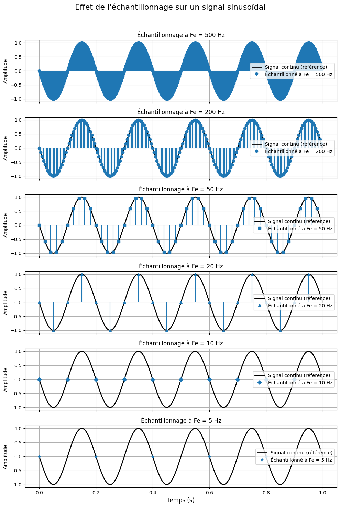

<link rel="stylesheet" href="https://cdn.jsdelivr.net/npm/katex/dist/katex.min.css">
<script defer src="https://cdn.jsdelivr.net/npm/katex/dist/katex.min.js"></script>
<script defer src="https://cdn.jsdelivr.net/npm/katex/dist/contrib/auto-render.min.js"
    onload="renderMathInElement(document.body);"></script>


Une correction du workshop 4 du projet signal peut être trouvée : [ici](Wkp4-Correction.ipynb)

## Bases du traitement du signal

Le traitement du signal est une discipline fondamentale pour l’analyse et la manipulation des données. Un signal peut être vu comme une fonction du temps (ou de toute autre variable indépendante) décrivant un phénomène physique.

### Applications du traitement du signal

- Son et audio : Compression MP3, égaliseurs audio, réduction de bruit.
- Imagerie : Compression JPEG, amélioration d’images, imagerie médicale (IRM).
- Télécommunications : Transmission de données, modulation, filtrage.
- Physiologie : Analyse des signaux ECG, EEG.

### Numérisation d’un signal

La numérisation transforme un signal analogique (continu) en signal numérique (discret) en trois étapes :

1. Échantillonnage : Prise de mesures régulières dans le temps.
2. Quantification : Arrondi des valeurs mesurées à des niveaux discrets.
3. Codage : Conversion en valeurs binaires.

Exemple quotidien : Lorsque vous écoutez une chanson enregistrée, un microphone transforme les vibrations sonores en signaux numériques pour stockage ou transmission.

---

## Échantillonnage

L'échantillonnage consiste à prélever des valeurs d’un signal continu à des intervalles de temps réguliers ( $\Delta t$ ) :

$$
t_k = k \cdot \Delta t, \quad k \in \mathbb{Z}
$$

$\Delta t$ détermine la précision de l’échantillonnage. Plus $\Delta t$ est petit, plus la résolution temporelle est élevée. Cependant, un échantillonnage excessif peut entraîner une surcharge de données.

La fréquence d’échantillonnage $F_e$ est l’inverse de l’intervalle d’échantillonnage :

$$
F_e = \frac{1}{\Delta t}
$$

#### Exemple quotidien

Un stroboscope éclaire un objet à intervalles réguliers pour créer une illusion de mouvement. La fréquence de clignotement détermine la vitesse apparente de l’objet.

### Théorème de Shannon-Nyquist

Un signal est parfaitement reconstruisible si la fréquence d’échantillonnage $F_e$ satisfait :

$$
F_e \geq 2 f_{max}
$$

où $f_{max}$ est la fréquence maximale du signal. Sinon, un phénomène d'aliasing se produit, où les hautes fréquences sont mal représentées.

#### Qu'est ce que l'aliasing ?

L'aliasing est un phénomène qui se produit lorsqu'un signal est échantillonné à une fréquence insuffisante, ce qui entraîne une distorsion du signal. Les hautes fréquences du signal ne sont pas correctement représentées, ce qui peut entraîner des erreurs de lecture ou de traitement.

Reprenons l'exemple d'échantillonnage du PDF et illustrons-le en Python.

#### Exemple : Échantillonnage d’un signal sinusoïdal

Un signal sinusoïdal est défini par :

$$
s(t) = A \sin(2 \pi f t + \phi)
$$

avec les paramètres suivants :

- Amplitude $A = 1$ ,
- Fréquence $f = 5 \, \text{Hz}$ ,
- Phase $\phi = \pi$ ,
- Fréquence d'échantillonnage $F_e = 1000 \, \text{Hz}$ ,
- Durée $D = 1 \, \text{s}$ .

On souhaite :

1. Générer le signal continu avec une fréquence d'échantillonnage élevée $F_e = 1000$ .
2. Échantillonner le signal à des fréquences différentes

---



## 3. Quantification

La quantification consiste à arrondir les amplitudes continues d’un signal à des valeurs discrètes. Cela entraîne une perte d’information appelée erreur de quantification.

### Concepts clés

- Pas de quantification ( $\Delta V$ ) :

  $$
  \Delta V = \frac{\text{Amplitude maximale} - \text{Amplitude minimale}}{2^n}
  $$

  où $n$ est le nombre de bits de la quantification.

- Exemple quotidien : En imagerie numérique, la profondeur de couleur (8 bits = 256 niveaux) influence la qualité de l'image.

### Code Python : Quantification

```python
# Signal continu
t = np.linspace(0, 1, 1000)
signal_continu = np.sin(2 * np.pi * 5 * t)

# Quantification à différents niveaux
quant_levels = [2, 4, 8]  # Niveaux de quantification
plt.figure(figsize=(10, 8))

for i, q in enumerate(quant_levels, 1):
    delta = 2 / q
    signal_quantifie = np.round(signal_continu / delta) * delta
    plt.subplot(3, 1, i)
    plt.plot(t, signal_continu, label="Signal continu", alpha=0.7)
    plt.step(t, signal_quantifie, label=f"Quantifié ({q} niveaux)", where='mid')
    plt.legend()
    plt.grid()

plt.tight_layout()
plt.show()
```

---

## 4. Transformée de Fourier

La transformée de Fourier (TF) convertit un signal du domaine temporel au domaine fréquentiel. Elle décompose un signal en une somme de sinusoïdes de différentes fréquences.

### Théorème de Fourier

Tout signal périodique peut être décomposé en une somme infinie de sinusoïdes. La transformée de Fourier permet d'analyser les composantes fréquentielles d'un signal.

#### Signification physique

La transformée de Fourier permet de décomposer un signal complexe en ses composantes de base. Cela permet d'analyser les fréquences présentes dans le signal et de mieux comprendre son comportement. Par exemple, un signal audio peut être décomposé en ses fréquences constitutives pour une analyse plus approfondie.

### Applications

Les transformées de Fourier sont utilisées dans de nombreux domaines, notamment :

- Traitement du signal (filtrage, détection de motifs).
- Analyse spectrale (identification des composantes fréquentielles).
- Compression audio (MP3) et vidéo (MPEG).

### Série de Fourier

Pour un signal périodique $s(t)$ , la décomposition est donnée par :

$$
s(t) = a*0 + \sum*{k=1}^\infty \left( a_k \cos(2 \pi k f_0 t) + b_k \sin(2 \pi k f_0 t) \right)
$$

### Code Python : Implémentation de la transformée de Fourier

```python
from scipy.fft import fft # Importer la fonction fft de scipy
# La fonction fft permet de calculer la transformée de Fourier d'un signal

# Signal sinusoïdal

t = np.linspace(0, 1, 1000)

signal = np.sin(2 * np.pi * 5 * t) + 0.5 * np.sin(2 * np.pi * 10 * t)

# Transformée de Fourier

signal_fft = fft(signal)

freq = np.fft.fftfreq(len(signal), t[1] - t[0])

# Affichage

plt.figure(figsize=(10, 6))

plt.subplot(2, 1, 1)
plt.plot(t, signal)
plt.title("Signal sinusoïdal")
plt.xlabel("Temps (s)")
plt.ylabel("Amplitude")
plt.grid()

plt.subplot(2, 1, 2)
plt.plot(freq, np.abs(signal_fft))
plt.title("Transformée de Fourier")
plt.xlabel("Fréquence (Hz)")
plt.ylabel("Amplitude")
plt.grid()

plt.tight_layout()
plt.show()
```

---

## 5. Filtrage numérique

Le filtrage numérique permet d'isoler ou de supprimer certaines fréquences dans un signal.

### Types de filtres

1. Passe-bas : Laisse passer les basses fréquences ( $f < f_c$ ).
2. Passe-haut : Laisse passer les hautes fréquences ( $f > f_c$ ).
3. Passe-bande : Laisse passer une plage de fréquences.

### Exemple quotidien

Les casques antibruit utilisent un filtre actif pour annuler les bruits basse fréquence.

### Code Python : Filtre passe-bas

```python
from scipy.signal import butter, filtfilt

# Signal bruité (50 Hz de bruit ajouté)
signal_bruite = signal + np.sin(2 * np.pi * 50 * t)

# Conception du filtre passe-bas
fc = 20  # Fréquence de coupure
b, a = butter(4, fc / (1000 / 2), btype='low')  # Filtre passe-bas d'ordre 4
signal_filtre = filtfilt(b, a, signal_bruite)

# Affichage
plt.figure(figsize=(10, 6))
plt.plot(t, signal_bruite, label="Signal bruité", alpha=0.7)
plt.plot(t, signal_filtre, label="Signal filtré (passe-bas)", linewidth=2)
plt.title("Filtrage passe-bas")
plt.xlabel("Temps (s)")
plt.ylabel("Amplitude")
plt.legend()
plt.grid()
plt.show()
```
