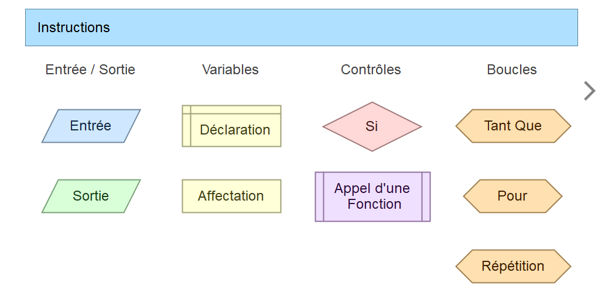

## **Les commandes de base en Flowgorithm**

Les commandes de base en Flowgorithm sont des instructions simples qui permettent de réaliser des opérations élémentaires telles que l'affectation de valeurs, l'affichage de messages, la lecture de données, les opérations mathématiques, les structures conditionnelles et les boucles. Dans l'image ci-dessous, vous pouvez voir les commandes de base disponibles dans Flowgorithm :




---

## 1. **Entrée/Sortie**

Ces blocs permettent d'interagir avec l'utilisateur ou de produire des résultats.

- **Entrée** :  
  Ce bloc permet de demander à l'utilisateur de fournir une valeur qui sera stockée dans une variable. Par exemple, demander son âge ou son nom.  
  **Représentation :** Un parallélogramme bleu.  
  **Exemple d'utilisation :**  
  ```
  Entrée : Saisir le nombre "x"
  ```
  
- **Sortie** :  
  Ce bloc permet d'afficher une information ou un résultat à l'utilisateur.  
  **Représentation :** Un parallélogramme vert.  
  **Exemple d'utilisation :**  
  ```
  Sortie : Afficher "La somme est égale à 10"
  ```
---

## 2. **Variables**

Les blocs liés aux variables permettent de gérer des données pendant l'exécution de l'algorithme.

- **Déclaration** :  
  Ce bloc est utilisé pour créer une nouvelle variable. Une variable est un espace mémoire qui stocke une valeur.  
  **Représentation :** Un rectangle jaune avec deux lignes.  
  **Exemple d'utilisation :**  
  ```
  Déclarer la variable "x" de type entier
  ```

- **Affectation** :  
  Ce bloc sert à attribuer une valeur à une variable.  
  **Représentation :** Un rectangle jaune.  
  **Exemple d'utilisation :**  
  ```
  Affecter "10" à la variable "x"
  ```

---

## 3. **Contrôles**

Les blocs de contrôle permettent de prendre des décisions ou d'exécuter des instructions spécifiques.

- **Si (Condition)** :  
  Ce bloc permet d'exécuter une série d'instructions seulement si une condition est remplie.  
  **Représentation :** Un losange rose.  
  **Exemple d'utilisation :**  
  ```
  Si (x > 10) Alors
      Afficher "x est supérieur à 10"
  Sinon
      Afficher "x est inférieur ou égal à 10"
  ```

- **Appel d'une Fonction** :  
  Ce bloc permet de réutiliser une portion de code définie dans une fonction séparée.  
  **Représentation :** Un rectangle violet avec deux traits verticaux.  
  **Exemple d'utilisation :**  
  ```
  Appeler la fonction "CalculSomme(x, y)"
  ```

---

## 4. **Boucles**

Les boucles permettent de répéter un ensemble d'instructions plusieurs fois, selon une condition.

- **Tant Que** :  
  Ce bloc permet de répéter les instructions tant qu'une condition est vraie.  
  **Représentation :** Un hexagone orange.  
  **Exemple d'utilisation :**  
  ```
  Tant que (x < 10)
      Ajouter 1 à x
  ```

- **Pour** :  
  Ce bloc est utilisé pour parcourir une plage de valeurs.  
  **Représentation :** Un hexagone orange.  
  **Exemple d'utilisation :**  
  ```
  Pour i de 1 à 10
      Afficher i
  ```

- **Répétition** :  
  Ce bloc exécute un ensemble d'instructions au moins une fois, puis continue tant qu'une condition est vraie.  
  **Représentation :** Un hexagone orange.  
  **Exemple d'utilisation :**  
  ```
  Répéter
      Ajouter 1 à x
  Jusqu'à ce que (x >= 10)
  ```

---
