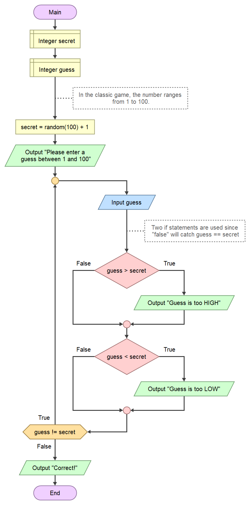

<style>
/* Style général de la FAQ */
.faq-container {
  max-width: 900px;
  margin: 0 auto;
  padding: 20px;
  font-family: 'Roboto', sans-serif;
}

.faq-title {
  font-size: 32px;
  color: #2a9df4;
  text-align: center;
  margin-bottom: 40px;
}

/* Style des sections */
.faq-section {
  margin-bottom: 20px;
  border-left: 5px solid #2a9df4; /* Bande colorée */
  background: #fff;
  border-radius: 8px;
  box-shadow: 0 4px 6px rgba(0, 0, 0, 0.1);
  overflow: hidden;
  transition: all 0.3s ease;
}

.faq-section-title {
  font-size: 20px;
  font-weight: bold;
  padding: 15px 20px;
  color: #333;
  cursor: pointer;
  display: flex;
  justify-content: space-between;
  align-items: center;
  background-color: #f9f9f9;
  border-bottom: 1px solid #ddd;
  transition: background-color 0.3s ease;
}

.faq-section-title:hover {
  background-color: #f0f0f0;
}

.faq-section-title .arrow {
  font-size: 16px;
  transform: rotate(0deg);
  transition: transform 0.3s ease;
}

.faq-section.collapsed .faq-section-title .arrow {
  transform: rotate(-90deg);
}

/* Gestion des sections */
.faq-content {
  max-height: 0; /* Fermé par défaut */
  padding: 0 20px; /* Réduit l'espace initial */
  overflow: hidden; /* Cache le contenu quand fermé */
  background-color: #fff;
  transition: max-height 0.5s ease, padding 0.5s ease;
}

.faq-section.open .faq-content {
  max-height: 1000px; /* Sera ajusté dynamiquement par le JS */
  padding: 20px; /* Ajoute l'espacement */
  padding-bottom: 30px; /* Ajoute un espace supplémentaire en bas */
}


.faq-section-title .arrow {
  font-size: 16px;
  transform: rotate(0deg);
  transition: transform 0.3s ease;
}

.faq-section.open .faq-section-title .arrow {
  transform: rotate(90deg);
}

/* Questions et réponses */
.faq-item {
  margin-bottom: 15px;
  overflow: hidden;
}

.faq-question {
  font-size: 18px;
  font-weight: bold;
  color: #2a9df4;
  margin-bottom: 5px;
  display: flex;
  align-items: center;
}

.faq-question::before {
  content: '●';
  color: #2a9df4;
  font-size: 18px;
  margin-right: 10px;
}

.faq-answer {
  font-size: 16px;
  color: #555;
  font-weight: bold;
  line-height: 1.6;
  margin-left: 20px;
}

/* Couleurs spécifiques aux sections */
.faq-section.excel {
  border-left-color: #1d6f42;
}
.faq-section.flowgorithm {
  border-left-color: #ff8c42;
}
.faq-section.arduino {
  border-left-color: #0072ce;
}
.faq-section.python {
  border-left-color: #f4c542;
}

/* Animation pour ouverture/fermeture */
.faq-content {
  max-height: 0;
  overflow: hidden;
}

.faq-section.open .faq-content {
  max-height: 500px;
  animation: slideDown 0.5s ease;
}

@keyframes slideDown {
  from {
    max-height: 0;
  }
  to {
    max-height: 500px;
  }
}

/* Responsive Design */
@media (max-width: 768px) {
  .faq-title {
    font-size: 24px;
  }

  .faq-section-title {
    font-size: 18px;
  }

  .faq-question {
    font-size: 16px;
  }

  .faq-answer {
    font-size: 14px;
  }
}
</style>

### Exercice : Jeu du Plus ou Moins

Vous devez créer un programme en Flowgorithm pour un jeu du **"Plus ou Moins"** où l'utilisateur doit deviner un nombre secret. Voici les consignes :

1. **Définir un nombre secret** : Utilisez une fonction qui génère un nombre aléatoire entre 1 et 100.  
2. **Saisie de l'utilisateur** : Demandez à l'utilisateur d'entrer un nombre compris entre 1 et 100.  
3. **Comparer la saisie au nombre secret** :  
   - Si la saisie est supérieure au nombre secret, affichez :  
     ```
     "Le nombre est trop grand !"
     ```
   - Si la saisie est inférieure au nombre secret, affichez :  
     ```
     "Le nombre est trop petit !"
     ```
4. **Répétez jusqu'à trouver** : Tant que l'utilisateur ne devine pas le bon nombre, continuez à lui demander une nouvelle tentative.  
5. **Victoire** : Une fois que l'utilisateur trouve le bon nombre, affichez un message :  
   ```
   Bravo ! Vous avez trouvé le nombre secret !
   ```

---

### Critères de réussite
- Le programme doit utiliser une **boucle** pour répéter la saisie tant que le nombre n’est pas trouvé.  
- Les **conditions** doivent permettre de comparer la saisie avec le nombre secret.  
- Un message doit être affiché pour guider l’utilisateur (trop grand, trop petit, ou correct).

---

### Extension facultative :
Ajoutez un compteur pour afficher le nombre de tentatives effectuées par l’utilisateur à la fin du jeu.  
Exemple de sortie :
```
Bravo ! Vous avez trouvé le nombre secret en 5 tentatives !
```

---

<div class="faq-container">
  <div class="faq-section flowgorithm">
    <div class="faq-section-title">
      Correction : Jeu du Plus ou Moins
      <span class="arrow">▼</span>
    </div>
    <div class="faq-content">
      <p>
        Voici un exemple de correction pour cet exercice en Flowgorithm :
      </p>
      
      <p>
        Le diagramme utilise une boucle pour répéter la saisie, avec des conditions permettant d’afficher si le nombre est trop grand ou trop petit, et un message de victoire une fois le nombre trouvé.
      </p>
    </div>
  </div>
</div>

<script>
document.addEventListener("DOMContentLoaded", function () {
  const sectionTitles = document.querySelectorAll(".faq-section-title");

  sectionTitles.forEach((title) => {
    title.addEventListener("click", function () {
      const section = this.parentElement;
      const content = section.querySelector(".faq-content");

      if (section.classList.contains("open")) {
        // Fermer la section
        section.classList.remove("open");
        content.style.maxHeight = "0"; // Réduit la hauteur
        content.style.padding = "0 20px"; // Réduit le padding
      } else {
        // Ouvrir la section
        section.classList.add("open");
        content.style.maxHeight = `${content.scrollHeight}px`; // Hauteur du contenu
        content.style.padding = "20px"; // Ajoute le padding
      }
    });
  });
});
</script>

---
