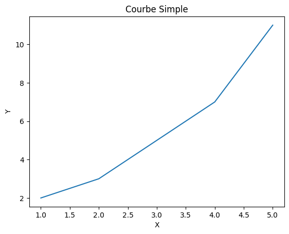
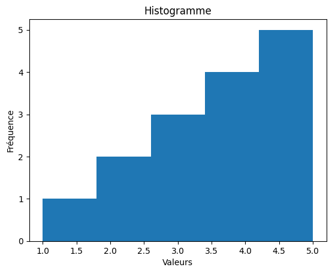

Matplotlib est une bibliothèque Python populaire pour la visualisation de données. Elle permet de créer une grande variété de graphiques et de diagrammes, tels que des courbes, des histogrammes, des nuages de points, etc. Matplotlib est souvent utilisé en conjonction avec des bibliothèques de calcul numérique comme NumPy et Pandas pour analyser et visualiser des données.

## Installation de Matplotlib

Pour installer Matplotlib, vous pouvez utiliser `pip`, le gestionnaire de paquets Python. Exécutez la commande suivante dans votre terminal (sur VS Code, ouvrez un terminal en appuyant sur `Ctrl + ù` ou en allant dans le menu `Terminal` > `Nouveau terminal`):

```bash
pip install matplotlib
```

Si `pip` n'est pas installé sur votre système, vous pouvez le faire en installant le paquet `python3-pip` :

```bash
sudo apt-get install python3-pip
```

## Importation de Matplotlib

Pour utiliser Matplotlib dans un script Python, vous devez l'importer en utilisant l'instruction `import`. Voici un exemple d'importation de Matplotlib :

```python
import matplotlib.pyplot as plt
```

Dans cet exemple, nous importons la bibliothèque Matplotlib et utilisons l'alias `plt` pour accéder à ses fonctions. Cela permet d'écrire des instructions plus courtes et plus lisibles pour créer des graphiques.

## Création de Graphiques avec Matplotlib

Matplotlib propose une variété de fonctions pour créer des graphiques et des diagrammes. Voici quelques exemples de graphiques couramment utilisés :

### Courbes

Les courbes sont des graphiques qui représentent des données sous forme de lignes. Elles sont souvent utilisées pour visualiser des séries temporelles ou des tendances. Voici un exemple de création d'une courbe simple :

```python
import matplotlib.pyplot as plt

# Données à afficher
x = [1, 2, 3, 4, 5]
y = [2, 3, 5, 7, 11]

# Créer un graphique de courbe
plt.plot(x, y)

# Ajouter des étiquettes aux axes
plt.xlabel('X') # Étiquette de l'axe des abscisses

plt.ylabel('Y') # Étiquette de l'axe des ordonnées

# Ajouter un titre au graphique
plt.title('Courbe Simple')

# Afficher le graphique
plt.show()
```

Voici ce que vous obtiendrez en exécutant ce script :



### Histogrammes

Les histogrammes sont des graphiques qui représentent la distribution des données sous forme de barres. Ils sont souvent utilisés pour visualiser la répartition des valeurs dans un ensemble de données. Voici un exemple de création d'un histogramme :

```python
import matplotlib.pyplot as plt

# Données à afficher
valeurs = [1, 2, 2, 3, 3, 3, 4, 4, 4, 4, 5, 5, 5, 5, 5]

# Créer un histogramme
plt.hist(valeurs, bins=5) # bins = nombre de barres

# Ajouter des étiquettes aux axes
plt.xlabel('Valeurs') # Étiquette de l'axe des abscisses

plt.ylabel('Fréquence') # Étiquette de l'axe des ordonnées

# Ajouter un titre à l'histogramme
plt.title('Histogramme')

# Afficher l'histogramme
plt.show()
```

Voici ce que vous obtiendrez en exécutant ce script :



Vous pouvez retrouver le jupyter notebook de cet exemple [ici](code-matplotlib.ipynb).