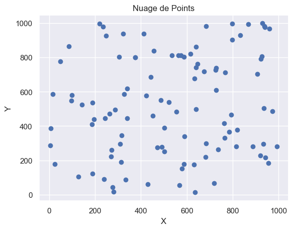
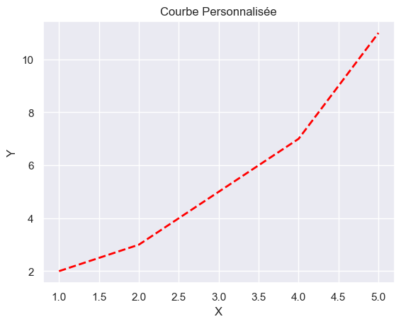
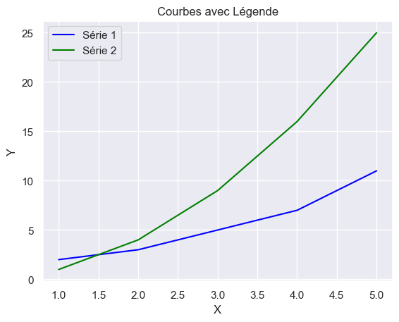
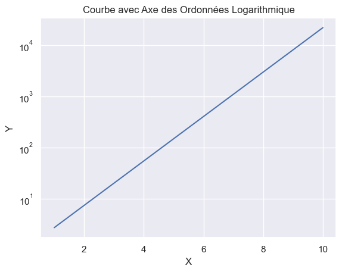
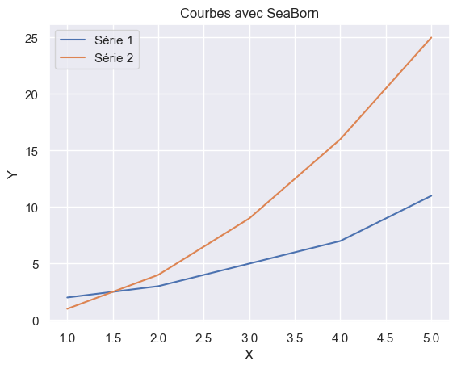

Matplotlib est une bibliothèque Python populaire pour la visualisation de données. Elle permet de créer une grande variété de graphiques et de diagrammes, tels que des courbes, des histogrammes, des nuages de points, etc. Matplotlib est souvent utilisé en conjonction avec des bibliothèques de calcul numérique comme NumPy et Pandas pour analyser et visualiser des données.

## Installation de Matplotlib

Pour installer Matplotlib, vous pouvez utiliser `pip`, le gestionnaire de paquets Python. Exécutez la commande suivante dans votre terminal (sur VS Code, ouvrez un terminal en appuyant sur `Ctrl + ù` ou en allant dans le menu `Terminal` > `Nouveau terminal`):

```bash
pip install matplotlib
```

Si `pip` n'est pas installé sur votre système, vous pouvez le faire en installant le paquet `python3-pip` :

```bash
sudo apt-get install python3-pip
```

## Importation de Matplotlib

Pour utiliser Matplotlib dans un script Python, vous devez l'importer en utilisant l'instruction `import`. Voici un exemple d'importation de Matplotlib :

```python
import matplotlib.pyplot as plt
```

Dans cet exemple, nous importons la bibliothèque Matplotlib et utilisons l'alias `plt` pour accéder à ses fonctions. Cela permet d'écrire des instructions plus courtes et plus lisibles pour créer des graphiques.

## Création de Graphiques avec Matplotlib

Matplotlib propose une variété de fonctions pour créer des graphiques et des diagrammes. Voici quelques exemples de graphiques couramment utilisés :

### Courbes

Les courbes sont des graphiques qui représentent des données sous forme de lignes. Elles sont souvent utilisées pour visualiser des séries temporelles ou des tendances. Voici un exemple de création d'une courbe simple :

```python
import matplotlib.pyplot as plt

# Données à afficher
x = [1, 2, 3, 4, 5]
y = [2, 3, 5, 7, 11]

# Créer un graphique de courbe
plt.plot(x, y)

# Ajouter des étiquettes aux axes
plt.xlabel('X') # Étiquette de l'axe des abscisses

plt.ylabel('Y') # Étiquette de l'axe des ordonnées

# Ajouter un titre au graphique
plt.title('Courbe Simple')

# Afficher le graphique
plt.show()
```

Voici ce que vous obtiendrez en exécutant ce script :


### Histogrammes

Les histogrammes sont des graphiques qui représentent la distribution des données sous forme de barres. Ils sont souvent utilisés pour visualiser la répartition des valeurs dans un ensemble de données. Voici un exemple de création d'un histogramme :

```python
import matplotlib.pyplot as plt

# Données à afficher
valeurs = [1, 2, 2, 3, 3, 3, 4, 4, 4, 4, 5, 5, 5, 5, 5]

# Créer un histogramme
plt.hist(valeurs, bins=5) # bins = nombre de barres

# Ajouter des étiquettes aux axes
plt.xlabel('Valeurs') # Étiquette de l'axe des abscisses

plt.ylabel('Fréquence') # Étiquette de l'axe des ordonnées

# Ajouter un titre à l'histogramme
plt.title('Histogramme')

# Afficher l'histogramme
plt.show()
```

Voici ce que vous obtiendrez en exécutant ce script :


### Nuages de Points

Les nuages de points sont des graphiques qui représentent des données sous forme de points. Ils sont souvent utilisés pour visualiser la relation entre deux variables. Voici un exemple de création d'un nuage de points :

```python
import matplotlib.pyplot as plt

# Données à afficher
x = [1, 2, 3, 4, 5]
y = [2, 3, 5, 7, 11]

# Créer un nuage de points
plt.scatter(x, y)

# Ajouter des étiquettes aux axes
plt.xlabel('X') # Étiquette de l'axe des abscisses

plt.ylabel('Y') # Étiquette de l'axe des ordonnées

# Ajouter un titre au nuage de points
plt.title('Nuage de Points')

# Afficher le nuage de points
plt.show()
```

Voici ce que vous obtiendrez en exécutant ce script :



## Personnalisation des Graphiques

Matplotlib offre de nombreuses options de personnalisation pour les graphiques, y compris les couleurs, les styles de ligne, les étiquettes, les titres, les légendes, etc. Voici quelques exemples de personnalisation des graphiques :

### Couleurs et Styles de Ligne

Vous pouvez personnaliser les couleurs et les styles de ligne des graphiques en utilisant des paramètres supplémentaires dans les fonctions `plot()`, `hist()`, `scatter()`, etc. Voici un exemple de personnalisation des couleurs et des styles de ligne :

```python
import matplotlib.pyplot as plt

# Données à afficher
x = [1, 2, 3, 4, 5]
y = [2, 3, 5, 7, 11]

# Créer un graphique de courbe avec des couleurs et des styles de ligne personnalisés
plt.plot(x, y, color='red', linestyle='--', linewidth=2) # Couleur rouge, ligne en pointillés, épaisseur de ligne 2

# Ajouter des étiquettes aux axes
plt.xlabel('X') # Étiquette de l'axe des abscisses

plt.ylabel('Y') # Étiquette de l'axe des ordonnées

# Ajouter un titre au graphique
plt.title('Courbe Personnalisée')

# Afficher le graphique
plt.show()
```

Voici ce que vous obtiendrez en exécutant ce script :



### Légendes

Vous pouvez ajouter des légendes aux graphiques pour identifier les différentes séries de données. Voici un exemple d'ajout d'une légende à un graphique :

```python
import matplotlib.pyplot as plt

# Données à afficher
x = [1, 2, 3, 4, 5]

y1 = [2, 3, 5, 7, 11]

y2 = [1, 4, 9, 16, 25]

# Créer un graphique de courbe avec une légende
plt.plot(x, y1, label='Série 1', color='blue') # Série 1 en bleu

plt.plot(x, y2, label='Série 2', color='green') # Série 2 en vert

# Ajouter une légende
plt.legend()

# Ajouter des étiquettes aux axes
plt.xlabel('X') # Étiquette de l'axe des abscisses

plt.ylabel('Y') # Étiquette de l'axe des ordonnées

# Ajouter un titre au graphique
plt.title('Courbes avec Légende')

# Afficher le graphique
plt.show()
```

Voici ce que vous obtiendrez en exécutant ce script :



### Axes Logarithmiques

Vous pouvez afficher les axes des graphiques avec une échelle logarithmique en utilisant les fonctions `semilogx()`, `semilogy()`, ou `loglog()`. Voici un exemple d'affichage d'un graphique avec un axe des ordonnées en échelle logarithmique :

```python
import matplotlib.pyplot as plt

import numpy as np # Importer NumPy pour générer des données et des échelles logarithmiques

# Données à afficher
x = np.linspace(1, 10, 100) # Générer 100 valeurs de 1 à 10

y = np.exp(x) # Calculer l'exponentielle de chaque valeur

# Créer un graphique avec un axe des ordonnées en échelle logarithmique
plt.semilogy(x, y)

# Ajouter des étiquettes aux axes
plt.xlabel('X') # Étiquette de l'axe des abscisses

plt.ylabel('Y') # Étiquette de l'axe des ordonnées

# Ajouter un titre au graphique
plt.title('Courbe avec Axe des Ordonnées Logarithmique')

# Afficher le graphique
plt.show()
```

Voici ce que vous obtiendrez en exécutant ce script :



## Pour aller plus loin : SeaBorn

SeaBorn est une bibliothèque Python basée sur Matplotlib qui offre des fonctionnalités supplémentaires pour la visualisation de données. Elle permet de créer des graphiques plus avancés et est souvent utilisée pour produire des graphiques esthétiques et informatifs. Voici un exemple d'importation de SeaBorn :

```python
import seaborn as sns
```

Pour utiliser SeaBorn, vous devez l'installer en utilisant `pip` :

```bash
pip install seaborn
```

SeaBorn propose une variété de fonctions pour créer des graphiques, y compris des diagrammes en barres, des diagrammes circulaires, des diagrammes en boîte, des diagrammes en violon, etc. Vous pouvez consulter la [documentation officielle de SeaBorn](https://seaborn.pydata.org/) pour en savoir plus sur ses fonctionnalités et ses options de personnalisation.

### Exemple d'Utilisation de SeaBorn

Voici un exemple d'utilisation de SeaBorn pour créer plusieurs courbes sur un même graphique :

```python
import matplotlib.pyplot as plt

import seaborn as sns

sns.set(style='darkgrid') # Utiliser un style de fond sombre

# Données à afficher
x = [1, 2, 3, 4, 5]

y1 = [2, 3, 5, 7, 11]

y2 = [1, 4, 9, 16, 25]

# Créer un graphique de courbes avec SeaBorn

sns.lineplot(x=x, y=y1, label='Série 1') # Série 1

sns.lineplot(x=x, y=y2, label='Série 2') # Série 2

# Ajouter des étiquettes aux axes
plt.xlabel('X') # Étiquette de l'axe des abscisses

plt.ylabel('Y') # Étiquette de l'axe des ordonnées

# Ajouter un titre au graphique
plt.title('Courbes avec SeaBorn')

# Afficher le graphique
plt.show()
```

Voici ce que vous obtiendrez en exécutant ce script :



SeaBorn offre des fonctionnalités avancées pour la visualisation de données et est largement utilisée dans le domaine de la science des données, de l'apprentissage automatique et de la recherche.

Vous pouvez retrouver le jupyter notebook de cet exemple [ici](code-matplotlib.ipynb)

## Exercices

### Exercice 1

Créez un graphique de courbe représentant la fonction sinus sur l'intervalle `[0, 2π]`. Ajoutez des étiquettes aux axes et un titre au graphique.

### Exercice 2

Créez un histogramme représentant la distribution des valeurs aléatoires générées par la fonction `randint()` du module `random`. Ajoutez des étiquettes aux axes et un titre à l'histogramme.

### Exercice 3

Créez un nuage de points représentant les coordonnées `(x, y)` de points aléatoires générés par la fonction `randn()` du module `numpy.random`. Ajoutez des étiquettes aux axes et un titre au nuage de points.

### Exercice 4

Personnalisez un graphique de votre choix en modifiant les couleurs, les styles de ligne, les étiquettes, les titres, etc.

### Exercice 5

Utilisez SeaBorn pour créer un graphique de votre choix en utilisant une fonction spécifique de SeaBorn, comme `barplot()`, `pieplot()`, `boxplot()`, `violinplot()`, etc.

