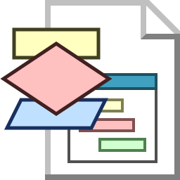
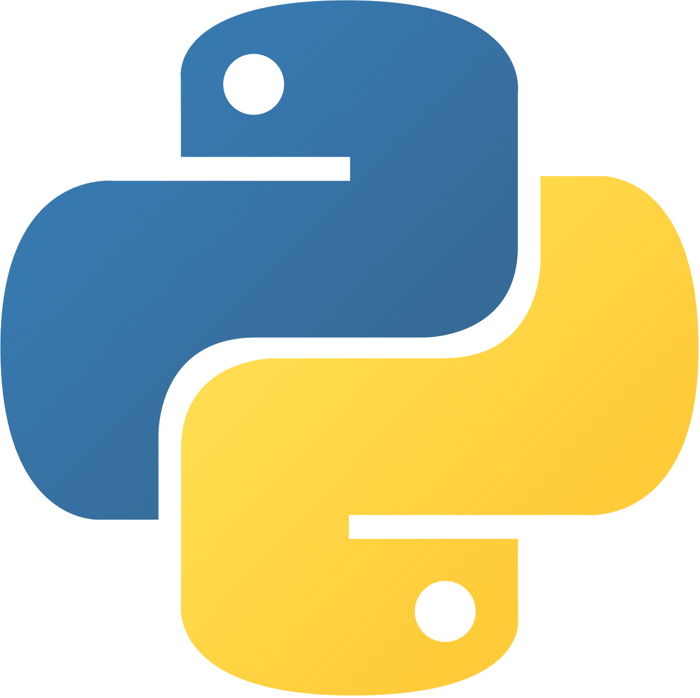
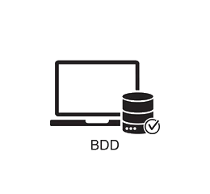

  
Bienvenue sur le site dédié aux ETS des CPIA1 du CESI de Montpellier. Ce site a pour but de vous accompagner dans votre apprentissage de la programmation en vous proposant des cours et des exercices.





  <a href="content/00-Excel/01-Cours.html" class="zone" aria-label="Accéder au cours Excel">
    

      
    

    
Excel

  </a>
  <a href="content/01-flowgorithme/00-Introduction.html" class="zone" aria-label="Accéder au cours Flowgorithm">
    

      
    

    
Flowgorithm

  </a>
  <a href="content/02-arduino/00-Introduction.html" class="zone" aria-label="Accéder au cours Arduino">
    

      
    

    
Arduino

  </a>
  <a href="content/03-python/0-avantCommencer.html" class="zone" aria-label="Accéder au cours Python">
    

      
    

    
Python

  </a>
    <a href="content/08-BDD/00-Introduction-SI.md" class="zone" aria-label="Accéder au cours sur la BDD">
    

      
    

    
BDD

  </a>

<footer class="footer">
  
© Rohan Fossé, Enseignant Responsable Pédagogique, CESI Montpellier, 2024

  
<a href="https://github.com/rohanfosse/CPIA1-info">Code source du site</a>

</footer>
