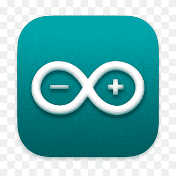

  <h1>CPIA 24/25 - Informatique</h1>

  

    
Bienvenue sur le site dédié aux ETS des CPIA1 du CESI de Montpellier. Ce site a pour but de vous accompagner dans votre apprentissage de la programmation en vous proposant des cours et des exercices.

  

  

  

    <a href="EI-python.html" class="alert">Cliquez ici pour l'Entrainement et conseils pour l'EI Python</a>
  

  

    <a href="Renforcement.html" class="alert">Cliquez ici pour le sujet étudié pendant le renforcement.</a>
    <a href="Renforcement-corrige.html"> La correction est disponible ici.</a>
  

  

    <a href="ExamBlanc-EI.html" class="alert">Cliquez ici pour l'exam blanc de l'EI pour s'entrainer</a>
  

  

    <a href="Courant-alternatif.html" class="new-alert">Cliquez ici pour la révision du CCTL Courant Alternatif.</a>
  

  

    <h2>Signal</h2>
    
    

      <a href="lien1.html">Cours sur le signal</a>
      <a href="lien2.html">Exercices sur le signal</a>
      <a href="lien3.html">Simulateur de signal</a>
    

  

  

    <a href="content/00-Excel/01-Cours.html" class="zone">
      

      
Excel

    </a>
    <a href="content/01-flowgorithme/00-Introduction.html" class="zone">
      

      
Flowgorithm

    </a>
    <a href="content/02-arduino/00-Introduction.html" class="zone">
      

      
Arduino

    </a>
    <a href="content/03-python/0-avantCommencer.html" class="zone">
      

      
Python

    </a>
  

<footer class="footer">
    
© Rohan Fossé, Enseignant Responsable Pédagogique, CESI Montpellier, 2024

    
<a href="https://github.com/rohanfosse/CPIA1-info">Code source du site</a>

</footer>